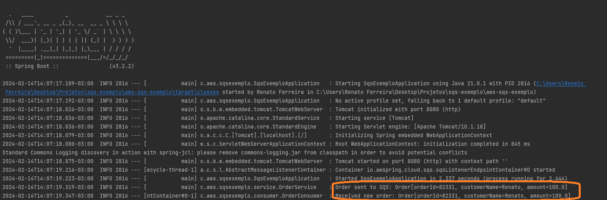

# Exemplo de Publicação e Consumo de Mensagens com AWS SQS e Spring Cloud para um sistema de pedidos


[](https://opensource.org/licenses/MIT)
[](https://www.oracle.com/java/technologies/javase-jdk11-downloads.html)
[](https://spring.io/projects/spring-boot)
[](https://docs.aws.amazon.com/sdk-for-java/v2/developer-guide/welcome.html)
[](https://spring.io/projects/spring-cloud)

Este projeto é um exemplo de integração com o Amazon Simple Queue Service (SQS) utilizando o Spring Boot e o Spring Cloud para um sistema de pedidos online.

## Descrição

O sistema de pedidos online tem como objetivo enviar informações do pedido para uma fila SQS quando uma nova ordem é recebida. Isso é útil para processar os pedidos de forma assíncrona e escalável, garantindo que as informações do pedido sejam entregues com segurança e confiabilidade.

O projeto demonstra como criar e consumir mensagens de uma fila SQS da AWS (Amazon Web Services) usando o Spring Boot em conjunto com o Spring Cloud. Ao receber uma nova ordem no sistema, os detalhes do pedido são encapsulados em uma mensagem e enviados para a fila SQS para processamento posterior.

## Tecnologias Utilizadas

- Java
- Spring Boot
- Spring Cloud
- AWS SDK v2
- LocalStack (para desenvolvimento local)

## Configuração

Antes de executar o projeto, certifique-se de ter configurado as seguintes propriedades:

- Configure as credenciais da AWS no seu ambiente ou utilize o LocalStack para simular os serviços da AWS localmente.
- Defina as configurações da fila SQS, como URL e região, no arquivo de propriedades.

Exemplo de configuração da fila SQS no arquivo `application.properties`:

* sqs.order.queue.url

## Execução

Para utilizar o LocalStack para desenvolvimento local:

- Instale o LocalStack conforme as instruções em: [LocalStack](https://github.com/localstack/localstack).
- Defina as configurações da fila SQS para apontar para o endpoint local do LocalStack.

## Execução

Para executar o projeto, siga estas etapas:

1. Clone o repositório para sua máquina local.
2. Certifique-se de ter configurado as propriedades da fila SQS conforme mencionado acima.
3. Execute a aplicação Spring Boot.

Exemplo de execução usando Maven:

* mvn spring-boot:run


### 
Ao final da execução do projeto, será possível verificar no log tanto a publicação quanto o consumo das mensagens na fila SQS.
````
INFO - Order sent to SQS: Order{orderId='número gerado aleatório', customerName='Renato', amount=100.0}
INFO - Received new order: Order{orderId='número gerado aleatório', customerName='Renato', amount=100.0}
````


## Documentação

- [Documentação do Spring Boot](https://spring.io/projects/spring-boot)
- [Documentação do Spring Cloud AWS](https://docs.awspring.io/spring-cloud-aws/docs/3.1.0/reference/html/index.html#starter-dependencies)
- [Documentação da AWS SDK v2](https://docs.aws.amazon.com/sdk-for-java/v2/developer-guide/welcome.html)

## Contribuição

Contribuições são bem-vindas! Sinta-se à vontade para abrir uma issue ou enviar um pull request com melhorias, correções de bugs ou novos recursos.

## Licença

Este projeto está licenciado sob a [MIT License](LICENSE).
