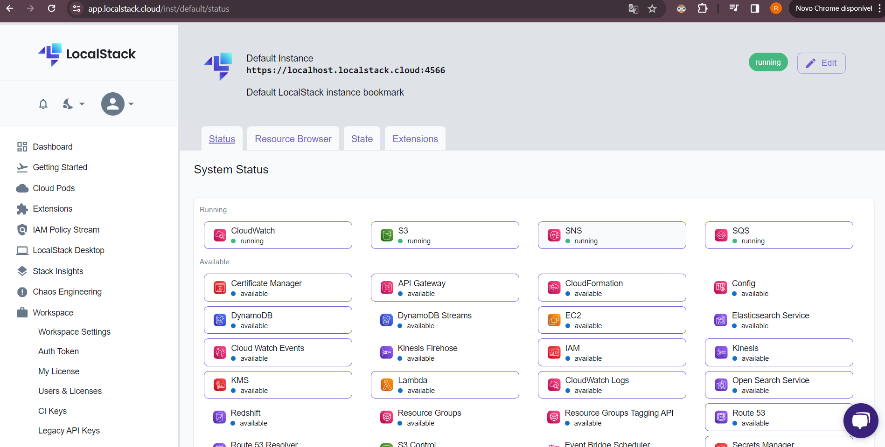

# Exemplo: AWS SQS 

Exemplo Publicando mensagem SQS e consumindo

Documentação:
https://docs.aws.amazon.com/pt_br/sqs/?icmpid=docs_homepage_serverless

LocalStack

Documentação Spring Cloud
https://docs.awspring.io/spring-cloud-aws/docs/3.1.0/reference/html/index.html#starter-dependencies

``
- src
    - main
        - java
            - com
                - aws
                    - sqsexemplo
                        - application
                            - SqsExemploApplication.java
                        - domain
                            - model
                                - MyMessage.java
                            - service
                                - SqsMessageService.java
                        - infrastructure
                            - config
                                - SQSConfig.java
                            - message
                                - SqsMessageSender.java

``

